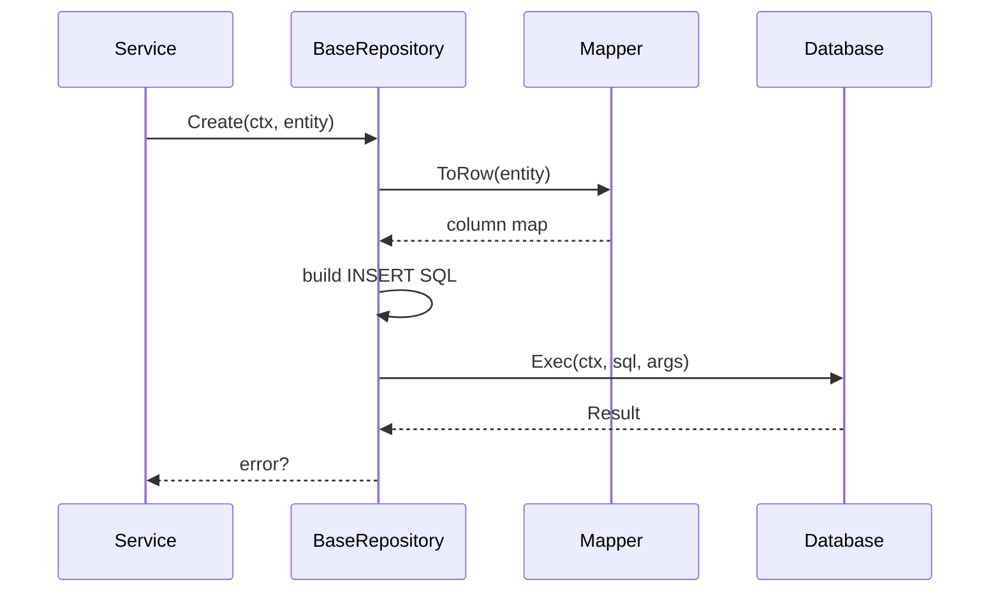
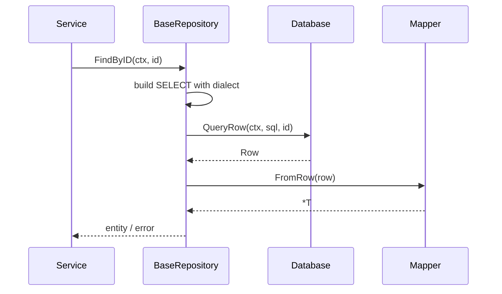
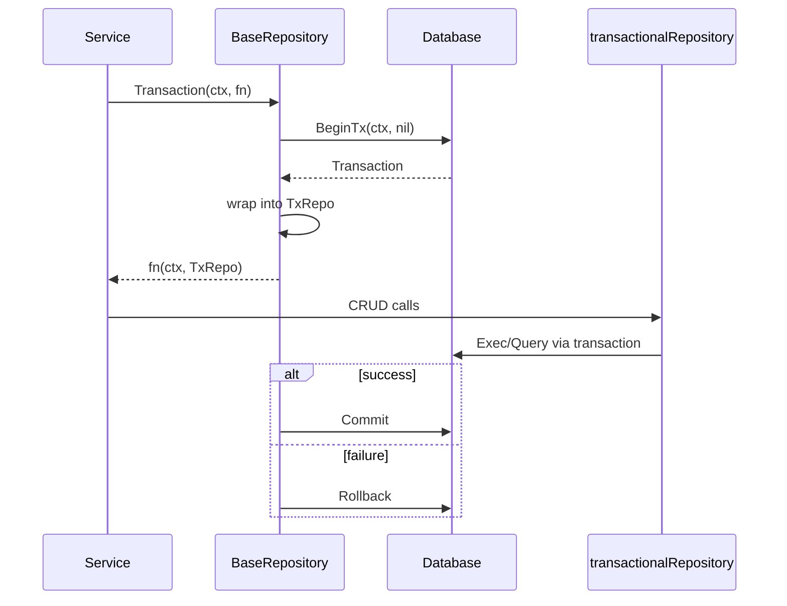

## BaseRepository Flow

### Components

- `BaseRepository[T]` holds a database provider and mapper.
- `transactionalRepository[T]` wraps `BaseRepository` with an active transaction.

### Create Operation

### Fetch Operation

### Transaction Wrapper

Key Points:

- Mappers abstract column mapping to keep repositories generic.
- Transactions reuse the same repository API via `transactionalRepository` to reduce boilerplate.
