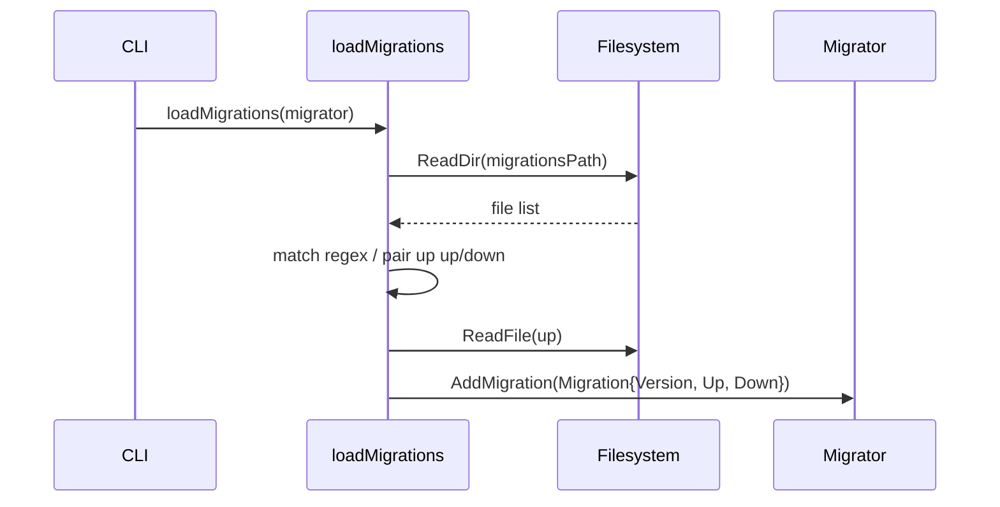
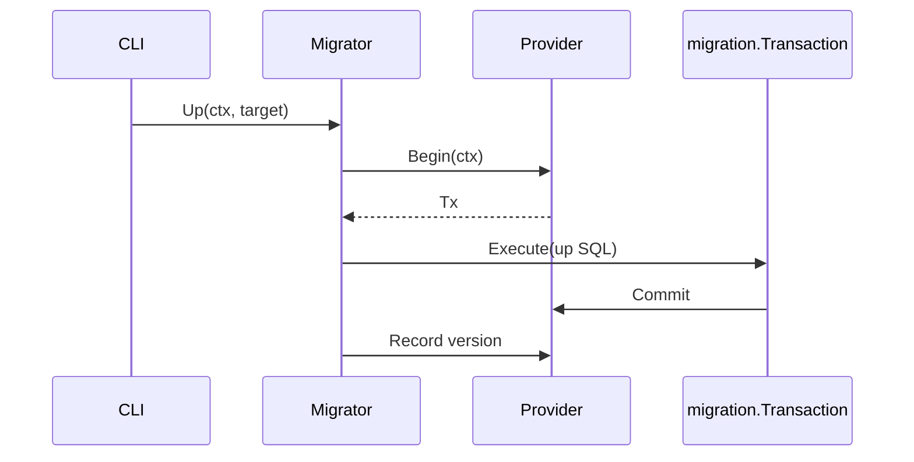
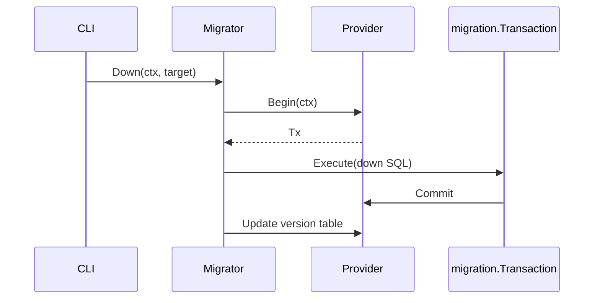

## Migration Framework Flow

### Components

- `migration.Migrator` – Orchestrates applying, rolling back, and tracking migrations.
- `migration.Provider` – Database-specific execution backend (e.g., SQLite provider).
- CLI commands in `cmd/dal-migrate` – Wrap migrator operations.

### Loading Migrations

### Applying Migrations (`up`)

### Rolling Back (`down`)

Notes:

- Checksum validation occurs before execution when enabled.
- Providers expose `Execute` APIs used by migration steps to run batches of SQL statements.
