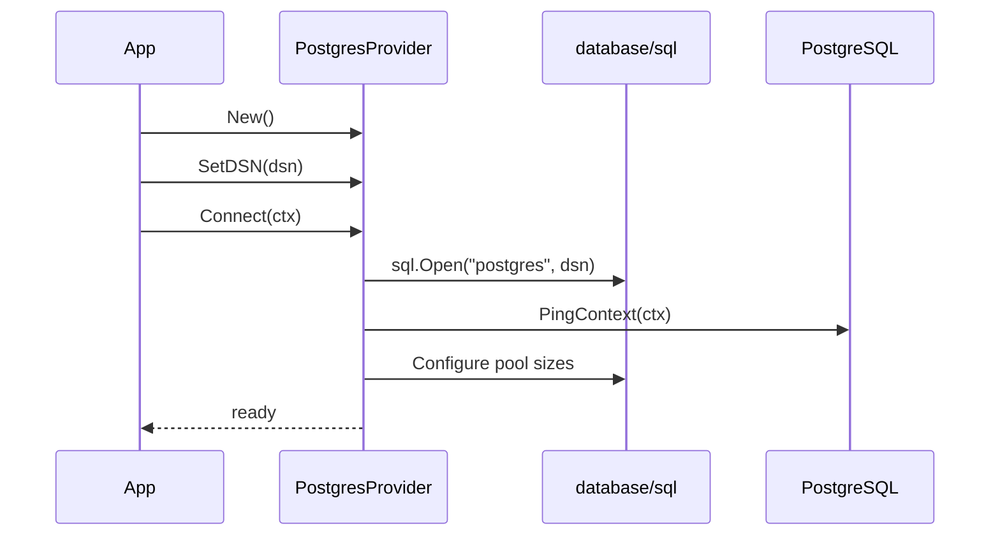
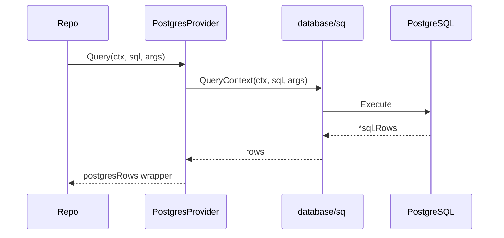
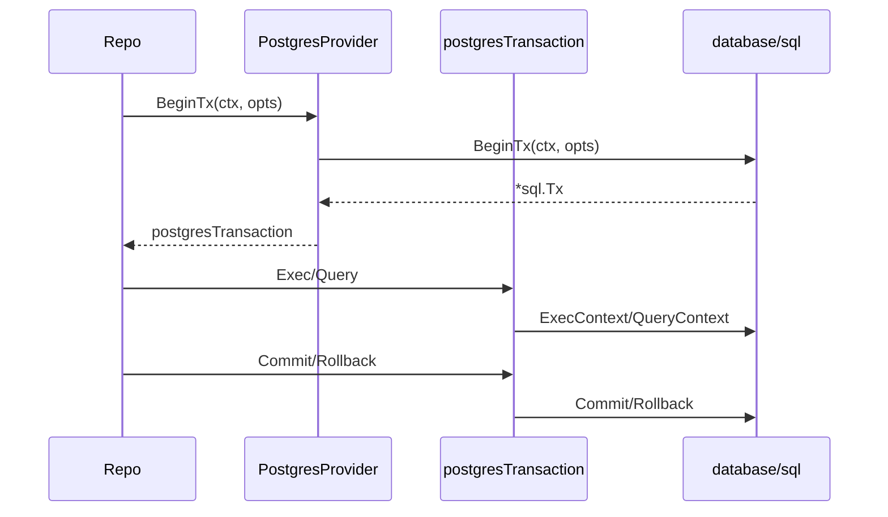

## PostgresProvider Flow

### Initialization

### Query Execution

### Transactions

Notes:

- The provider implements `interfaces.Database` and exposes the PostgreSQL dialect.
- `postgresTransaction` satisfies `interfaces.Transaction` by delegating to `*sql.Tx`.
