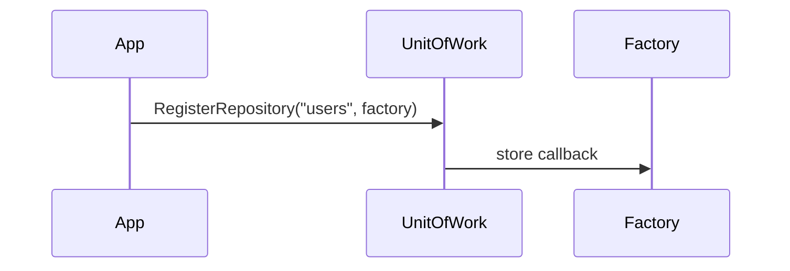
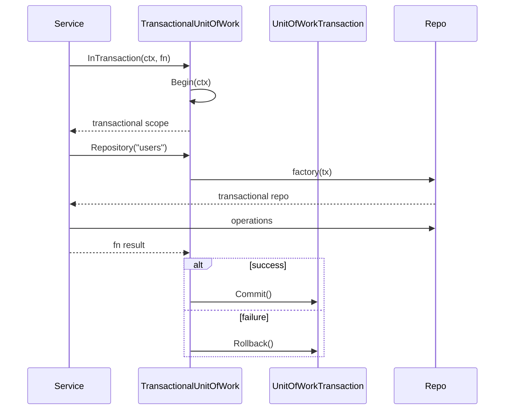

## Unit of Work Flow

### Registration

### InTransaction Helper

Implementation Notes:

- Factories receive the current transaction, ensuring repositories share the same context.
- `TransactionalUnitOfWork` wraps boilerplate so service code remains concise.
