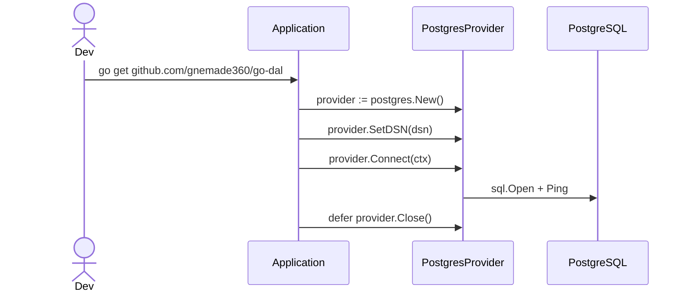

## Getting Started

This guide explains how to install `go-dal`, initialize a provider, and wire repositories into your application. It also highlights recommended development practices.

### Installation

```bash
go get github.com/gnemade360/go-dal
```

When working from a local checkout (for example, alongside `go-dal-examples`), add a `replace` entry in your consumer module's `go.mod`:

```go
replace github.com/gnemade360/go-dal => ../go-dal
```

Run `go mod tidy` afterward to ensure the dependency graph is up to date.

### Requirements

- Go 1.21 or later
- PostgreSQL server (currently-supported provider) 
- For migration examples: SQLite 3 (for the built-in migration provider)
- Optional: Docker or Podman to spin up an ephemeral database instance

### Initialization Flow



### Bootstrapping Steps

1. **Configure the provider** – Instantiate `postgres.New()`, set the DSN, and call `Connect(ctx)` to establish the pool.
2. **Instantiate repositories** – Use `repository.NewBaseRepository` with an entity mapper or a provider-specific repository (as in the basic CRUD example).
3. **Integrate into services** – Inject repositories into handlers, services, or command layers. Use Unit of Work abstractions for transactional operations spanning multiple repositories.
4. **Run migrations** – Before interacting with the application, execute the migration CLI (`dal-migrate up`) so the schema matches the entity definitions.

Next, explore [`usage/repositories.md`](usage/repositories.md) for detailed code samples and advanced repository patterns.
