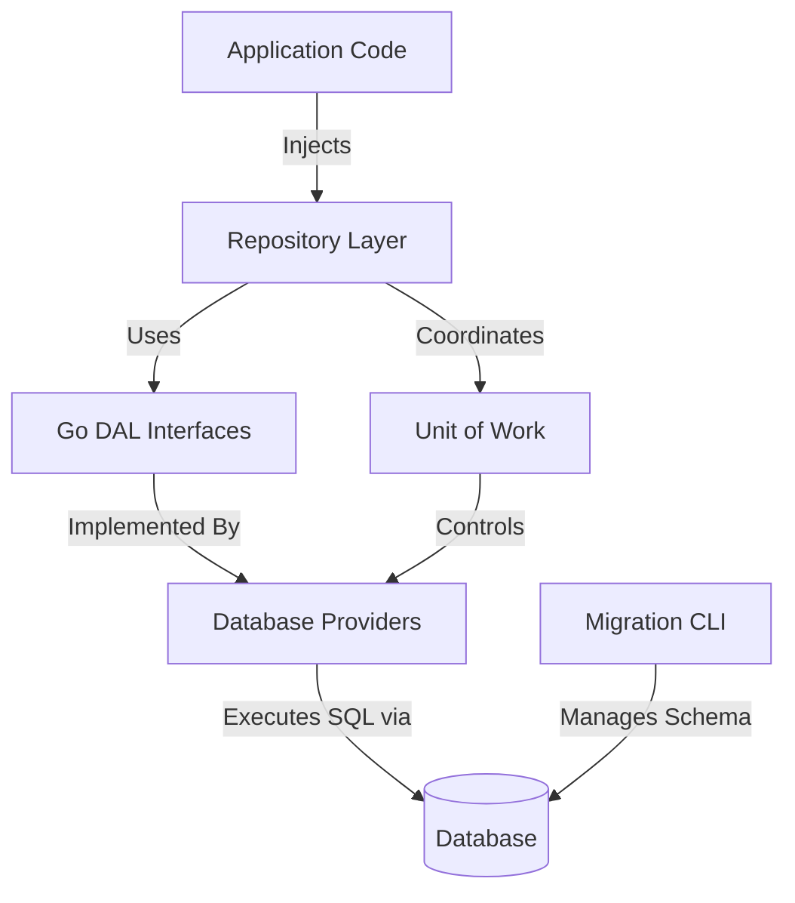

# Go DAL Documentation

Welcome to the official documentation site for the `go-dal` (Go Database Abstraction Layer) library.

## What is Go DAL?

Go DAL is a modular data-access toolkit that provides:

- A clean separation between business logic and persistence via repositories.
- Provider interfaces for plugging in different SQL backends.
- Unit of Work abstractions to orchestrate transactions across repositories.
- Built-in database migration tooling.

The project is actively evolving—several advanced features (additional providers, query builder, soft deletes, audit logging, etc.) remain on the roadmap. The current release focuses on PostgreSQL support, generic repository foundations, and the migration CLI.

## Architecture Overview

The application injects repository instances that rely on Go DAL interfaces. Providers implement database-specific behavior, while the Unit of Work orchestrates transactional operations across repositories. The migration CLI operates alongside the runtime path to manage schema evolution.

## Documentation Structure

- [`getting-started.md`](getting-started.md) – Installation, configuration, first steps, and bootstrapping walkthrough.
- [`usage/repositories.md`](usage/repositories.md) – Detailed repository patterns, specifications, and transaction handling.
- [`providers/postgres.md`](providers/postgres.md) – PostgreSQL provider behavior, lifecycle, and configuration options.
- [`migrations/cli.md`](migrations/cli.md) – Migration CLI usage, flags, file naming conventions, and workflow diagrams.
- [`examples.md`](examples.md) – Links to runnable demos in the `go-dal-examples` workspace with usage instructions.
- [`roadmap.md`](roadmap.md) – Current status, completed milestones, and planned enhancements.

Use `mkdocs` or any static site generator (e.g., Docusaurus, Hugo) to turn these Markdown files into a browsable documentation site. If serving with MkDocs, place an `mkdocs.yml` in the repository root referencing the pages above and publish via GitHub Pages or an internal site.
