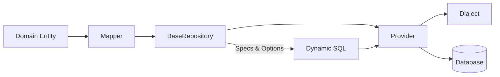
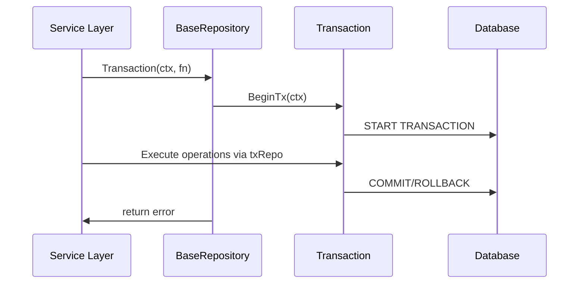

## Working with Repositories

Go DAL provides a generic repository implementation (`repository.BaseRepository`) plus interfaces for building composable specifications, query options, and transactional flows. This section dives into the recommended patterns.

### Conceptual Flow



Entities feed into mappers that translate between Go structs and SQL column/value maps. The repository leverages the provider (and underlying dialect) to execute SQL built from specifications and query options.

### Defining Entities

Entities must implement `dal/interfaces.Entity` so the library can manage identifiers and table names:

```go
type User struct {
    ID        string    `db:"id"`
    Name      string    `db:"name"`
    Email     string    `db:"email"`
    CreatedAt time.Time `db:"created_at"`
    UpdatedAt time.Time `db:"updated_at"`
}

func (u *User) GetID() string     { return u.ID }
func (u *User) SetID(id string)   { u.ID = id }
func (u *User) TableName() string { return "users" }
```

### Base Repository Usage

```go
provider := postgres.New()
provider.SetDSN(dsn)
if err := provider.Connect(ctx); err != nil {
    log.Fatal(err)
}

mapper := repository.NewBaseMapper[User]()
userRepo := repository.NewBaseRepository[User](provider, mapper)

newUser := &User{Name: "Alice", Email: "alice@example.com"}
if err := userRepo.Create(ctx, newUser); err != nil {
    log.Fatal(err)
}

fetched, err := userRepo.FindByID(ctx, newUser.ID)
if err != nil {
    log.Fatal(err)
}
fmt.Println("Created user:", fetched.Name)
```

### Specifications and Query Options

- Implement the `Specification` interface (see `repository/specification.go`) or use the provided builders to express filters, joins, and composed predicates.
- Apply `QueryOption` helpers (from `repository/options.go`) to configure ordering, pagination, distinct queries, or `FOR UPDATE` locking.

Example:

```go
spec := repository.Where(repository.Eq("email", "alice@example.com"))
users, err := userRepo.FindWithOptions(ctx, spec, repository.OrderBy("created_at", repository.OrderDesc), repository.Limit(10))
```

### Transactions and Unit of Work



- Use `BaseRepository.Transaction(ctx, fn)` to run a closure within a transaction.
- For cross-repository orchestration, build on the `unitofwork` package which centralizes transaction control and repository instantiation.
- Transactions surface as the same repository interface, simplifying the service-layer code.

### Best Practices

1. Keep entity structs minimal and focused on persistence fields.
2. Centralize domain logic in services; repositories should remain thin.
3. Use specifications rather than raw SQL strings for reusable filters.
4. Wrap write operations in transactions via Unit of Work when multiple repositories participate.
